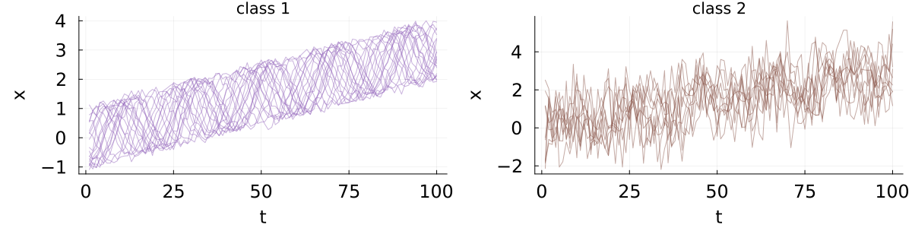

# Classification

This tutorial for MPSTime will take you through the basic steps needed to fit an MPS to a time-series dataset.

## Demo dataset

First, import or generate your data. Here, we generate a two class "noisy trendy sine" dataset for the sake of demonstration, but if you have a dataset in mind, you can skip to the next section. Our demonstration dataset consists of a sine function with a randomised phase, plus a linear trend, plus some normally distributed noise. Each time series in class ``c`` at time ``t`` is given by:

```math
x^c_t = \sin{\left(\frac{2\pi}{20}t + \psi\right)} + \frac{mt}{T} + \sigma_c n_t\,,
```

where ``m`` is the slope of a linear trend, ``\psi \in [0, 2\pi)`` is a uniformly random phase offset, ``\sigma_c`` is the noise scale, and ``n_t \sim \mathcal{N}(0,1)`` are  normally distributed random variables. 

The two classes will be distinguished by their noise levels. The class one time series ``x^1`` have ``\sigma_1 = 0.1``, and the class two time series ``x^2`` have ``\sigma_2 = 0.9``.
Here are a few time-series instances from each class:



The below code sets this up:

```@example 1 
using MPSTime 
using Random # fix rng seed
rng = Xoshiro(1); # define trendy sine function
function trendy_sine(T::Integer, n_inst::Integer, noise_std::Real, rng)
    X = Matrix{Float64}(undef, n_inst, T)
    ts = 1:T
    for series in eachrow(X)
        phase = 2 * pi * rand(rng)
        @. series = sin(pi/10 *ts + phase) + 3 * ts / T + noise_std * randn(rng) 
    end
    return X
end;
ntimepoints = 100; # specify number of samples per instance
ntrain_instances = 300; # specify num training instances
ntest_instances = 200; # specify num test instances
X_train = vcat(
    trendy_sine(ntimepoints, ntrain_instances ÷ 2, 0.1, rng),
    trendy_sine(ntimepoints, ntrain_instances ÷ 2, 0.9, rng)
);
y_train = vcat(
    fill(1, ntrain_instances ÷ 2),
    fill(2, ntrain_instances ÷ 2)
);
X_test = vcat(
    trendy_sine(ntimepoints, ntest_instances ÷ 2, 0.1, rng),
    trendy_sine(ntimepoints, ntest_instances ÷ 2, 0.9, rng)
);
y_test = vcat(
    fill(1, ntest_instances ÷ 2),
    fill(2, ntest_instances ÷ 2)
);
```

## Training an MPS
For the most basic use of fitMPS, select your hyperparameters, and run the [`fitMPS`](@ref) function. 
Some (truncated) output from our noisy trendy sine datam with default hyperparameters is given below. 

```@example 1
opts = MPSOptions() # no arguments gives default hyperparameters
mps, info, test_states = fitMPS(X_train, y_train, X_test, y_test, opts)
```

[`fitMPS`](@ref) doesn't use `X_test` or `y_test` for anything except printing performance evaluations, so it is safe to leave them blank. For unsupervised learning, input a dataset with only one class, or only pass `X_train` ( `y_train` has a default value of `zeros(Int, size(X_train, 1))` ).

The `mps::TrainedMPS` can be passed directly to [`classify`](@ref) for classification, or [`init_imputation_problem`](@ref) to set up an imputation problem. The info `info` provides a short training summary, which can be pretty-printed with [`sweep_summary`](@ref).

You can use `test_states` to print a summary of the MPS performance on the test set.
```Julia
Julia> get_training_summary(mps, test_states; print_stats=true)

         Overlap Matrix
┌──────┬───────────┬───────────┐
│      │   |ψ1⟩    │   |ψ2⟩    │
├──────┼───────────┼───────────┤
│ ⟨ψ1| │ 5.022e-01 │ 2.216e-04 │
├──────┼───────────┼───────────┤
│ ⟨ψ2| │ 2.216e-04 │ 4.978e-01 │
└──────┴───────────┴───────────┘
          Confusion Matrix
┌──────────┬───────────┬───────────┐
│          │ Pred. |1⟩ │ Pred. |2⟩ │
├──────────┼───────────┼───────────┤
│ True |1⟩ │       100 │         0 │
├──────────┼───────────┼───────────┤
│ True |2⟩ │        15 │        85 │
└──────────┴───────────┴───────────┘
┌───────────────────┬───────────┬──────────┬──────────┬─────────────┬─────────┬───────────┐
│ test_balanced_acc │ train_acc │ test_acc │ f1_score │ specificity │  recall │ precision │
│           Float64 │   Float64 │  Float64 │  Float64 │     Float64 │ Float64 │   Float64 │
├───────────────────┼───────────┼──────────┼──────────┼─────────────┼─────────┼───────────┤
│             0.925 │       1.0 │    0.925 │ 0.924576 │       0.925 │   0.925 │  0.934783 │
└───────────────────┴───────────┴──────────┴──────────┴─────────────┴─────────┴───────────┘
```

## Hyperparameters

There are number of hyperparameters and data preprocessing options that can be specified using `MPSOptions(; key=value)`


```@docs
MPSOptions
```

You can also print a formatted table of options with [`print_opts`](@ref) (beware long output)

```Julia
print_opts(opts)
```
```
┌────────────┬──────────────┬──────────────────────────┬────────┬───────────────────────────┬──────────┬─────────┬─────────┬──────────┬──────────────────┬───────────────────┬───────────┬─────────────────────────┬──────────┬───────┬────────────┬───────────────────────────┬─────────┬───────────────────┬───────────────┬────────┬───────────┬───────────┬─────────────────┬─────────┐
│ track_cost │ update_iters │ train_classes_separately │ minmax │ return_encoding_meta_info │    dtype │ nsweeps │  cutoff │ chi_init │         encoding │           rescale │ loss_grad │             data_bounds │ init_rng │     d │ exit_early │ encode_classes_separately │     eta │ sigmoid_transform │ aux_basis_dim │  bbopt │ log_level │ verbosity │ projected_basis │ chi_max │
│       Bool │        Int64 │                     Bool │   Bool │                      Bool │ DataType │   Int64 │ Float64 │    Int64 │           Symbol │ Tuple{Bool, Bool} │    Symbol │ Tuple{Float64, Float64} │    Int64 │ Int64 │       Bool │                      Bool │ Float64 │              Bool │         Int64 │ Symbol │     Int64 │     Int64 │            Bool │   Int64 │
├────────────┼──────────────┼──────────────────────────┼────────┼───────────────────────────┼──────────┼─────────┼─────────┼──────────┼──────────────────┼───────────────────┼───────────┼─────────────────────────┼──────────┼───────┼────────────┼───────────────────────────┼─────────┼───────────────────┼───────────────┼────────┼───────────┼───────────┼─────────────────┼─────────┤
│      false │            1 │                    false │   true │                     false │  Float64 │       5 │ 1.0e-10 │        4 │ Legendre_No_Norm │     (false, true) │       KLD │              (0.0, 1.0) │     1234 │     5 │      false │                     false │    0.01 │              true │             2 │   TSGO │         3 │         1 │           false │      25 │
└────────────┴──────────────┴──────────────────────────┴────────┴───────────────────────────┴──────────┴─────────┴─────────┴──────────┴──────────────────┴───────────────────┴───────────┴─────────────────────────┴──────────┴───────┴────────────┴───────────────────────────┴─────────┴───────────────────┴───────────────┴────────┴───────────┴───────────┴─────────────────┴─────────┘

julia> 
```

## Classification
To predict the class of unseen data, use the [`classify`](@ref) function.

```@docs
classify(::TrainedMPS, ::AbstractMatrix, ::MPSOptions)
```

For example, for the noisy trendy sine from earlier:
```Julia
julia> predictions = classify(mps, X_test, opts);
julia> using Statistics
julia> mean(predictions .== y_test)
0.925
```

## Training with a custom basis
To train with a custom basis, first, declare a custom basis with [`function_basis`](@ref), and pass it in as the last argument to [`fitMPS`](@ref). For this to work, the encoding hyperparameter must be set to `:Custom` in `MPSOptions`

```Julia
encoding = function_basis(...)
fitMPS(X_train, y_train, X_test, y_test, MPSOptions(; encoding=:Custom), encoding)
```

## Docstrings

```@docs
fitMPS(::Matrix, ::Vector, ::Matrix, ::Vector, ::MPSOptions, ::Nothing)
sweep_summary(info)
get_training_summary(mps::TrainedMPS, test_states::EncodedTimeSeriesSet)
print_opts
```
