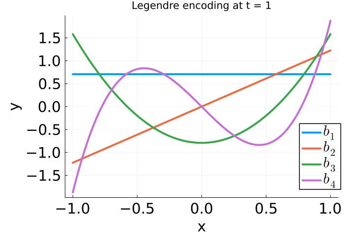
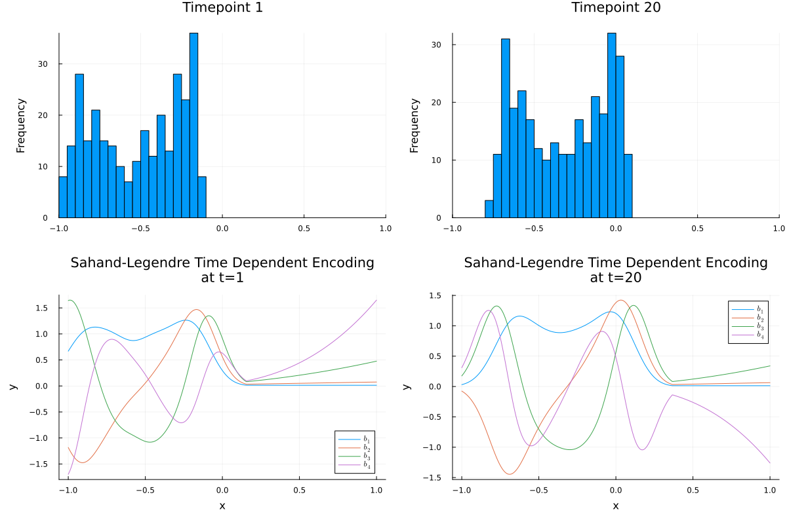
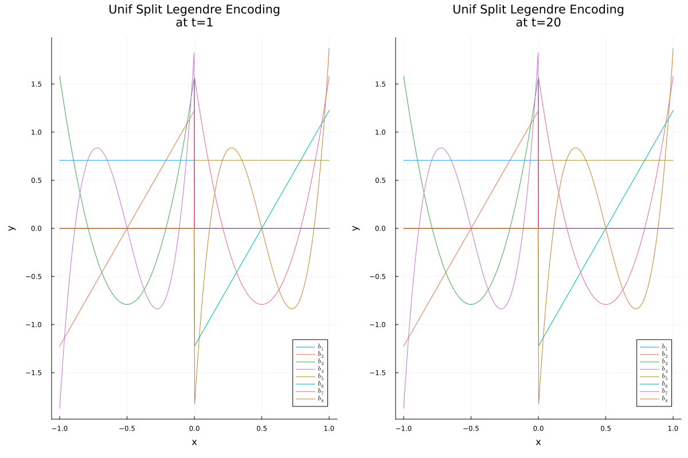

# Encodings
## Overview
To use MPS methods on time-series data, the continuous time-series amplitudes must be mapped to MPS compatible vectors using an *encoding*. There are a number of encodings built into this library, and they can be specified by the `encoding` keyword in [`MPSOptions`](@ref).

```@docs
Encoding
```

Encodings can be visualized with the [`plot_encoding`](@ref) function.

```Julia
basis, p = plot_encoding(:legendre, 4)
```



For data driven bases, the data histograms can be plotted alongside for reference:
```Julia
basis, p = plot_encoding(:sahand_legendre_time_dependent, 4, X_train; tis=[1,20]); # X_train is taken from the noisy trendy sine demo in the Imputation section
```


## Using a SplitBasis encoding

One way to increase the encoding dimension is to repeat a basis many times across the encoding domain in 'bins'. In theory, this can be advantageous when data is concentrated in narrow regions in the encoding domain, as very fine bins can be used to reduce encoding error in well-populated regions, while computational effort can be saved with wide bins in sparsely-population regions. To this end, we provide the "Split" bases.

The uniform-split encoding, which simply bins data up as a proof of concept:

```Julia
basis, p = plot_encoding(uniform_split(:legendre), 8, X_train; tis=[1,20], aux_basis_dim=4);
```



And the histogram-split encoding, which narrows the bins in frequently occurring regions.

```Julia
basis, p = plot_encoding(histogram_split(:legendre), 8, X_train; tis=[1,20], aux_basis_dim=4);
```


Every data-independent encoding can be histogram split and uniform split, including other split bases:

```Julia
basis, p = plot_encoding(histogram_split(uniform_split(:legendre)), 16, X_train; tis=[1,20], aux_basis_dim=8, size=(1600,900));
```


## Custom encodings

Custom encodings can be declared using [`function_basis`](@ref).

```@docs
function_basis
```

To use a custom encoding, you must manually pass it into [`fitMPS`](@ref).

```Julia
encoding = function_basis(...)
fitMPS(X_train, y_train, X_test, y_test, MPSOptions(; encoding=:Custom), encoding)
```

```@docs
plot_encoding(::Symbol, ::Integer)
```
