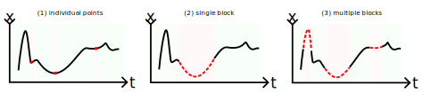
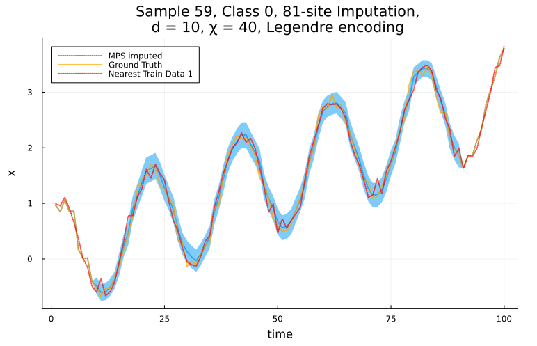
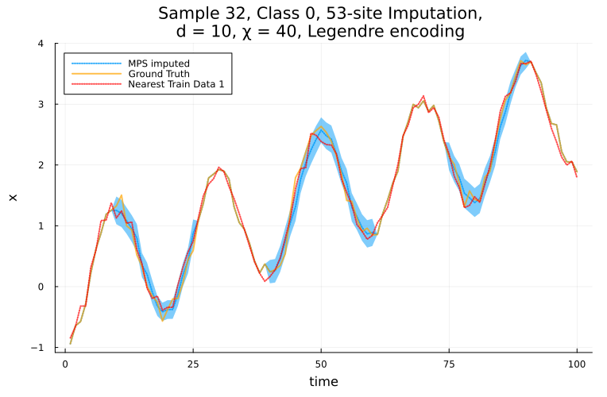
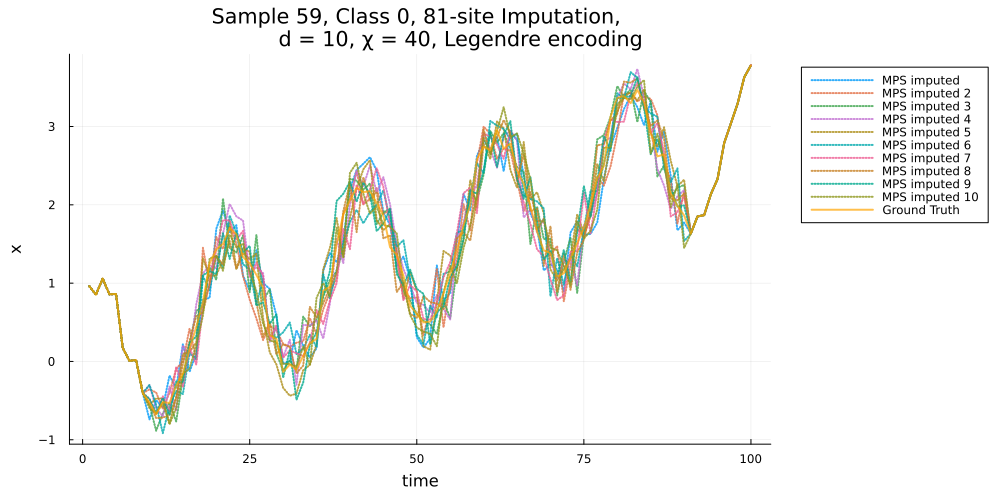

# [Imputation](@id Imputation_top)
## Overview 
#### Imputation Scenarios
MPSTime supports univariate time-series imputation with three key patterns of missing data:
1. Individual missing points (e.g., values missing at $t = 10, 20, 80$)
1. Single contiguous blocks (e.g., values missing from $t = 25-70$)
1. Multiple contiguous blocks (e.g., values missing from $t = 5-10$, $t = 25-50$ and $t = 80-90$)



MPSTime can also handle any combination of these patterns.
For instance, you might need to impute a single contiguous block from $t = 10-30$, plus individual missing points at $t = 50$ and $t=80$.

## Setup

The first step is to train an MPS. 
Here, we'll train an MPS in an unsupervised manner (no class labels) using a noisy trendy sinusoid.

```Julia
# Fix rng seed
using Random
rng = Xoshiro(1)

# dataset size
ntimepoints = 100
ntrain_instances = 300
ntest_instances = 200

# generate the train and test datasets
X_train, _ = trendy_sine(ntimepoints, ntrain_instances; sigma=0.1, rng=rng);
X_test, _ = trendy_sine(ntimepoints, ntest_instances; sigma=0.1, rng=rng);

# hyper parameters and training
opts = MPSOptions(d=10, chi_max=40, sigmoid_transform=false);
mps, info, test_states= fitMPS(X_train, opts);
```

Next, we initialize an imputation problem. This does a lot of necessary pre-computation:
```Julia
julia> imp = init_imputation_problem(mps, X_test);

++++++++++++++++++++++++++++++++++++++++++++++++++++++++++++
                         Summary:

 - Dataset has 300 training samples and 200 testing samples.
Slicing MPS into individual states...
 - 1 class(es) were detected.
 - Time independent encoding - Legendre - detected.
 - d = 10, chi_max = 40
Re-encoding the training data to get the encoding arguments...

 Created 1 ImputationProblem struct(s) containing class-wise mps and test samples.
```
A summary of the imputation problem setup is printed to verify the model parameters and dataset information.
For __multi-class__ data, you can pass `y_test` to `init_imputation_problem` in order to exploit the labels / class information while doing imputation.

## Imputing missing values
### Single-block Imputation
Now, decide how you want to impute the missing data.
The necessary options are:
- `class::Integer`: The class of the time-series instance we are going to impute, leave as zero for "unlabelled" data (i.e., all data belong to the same class).
- `impute_sites`: The MPS sites (time points) that are missing (inclusive).
- `instance_idx`: The time-series instance from the chosen class in the test set.
- `method`: The imputation method to use. Can be trajectories (ITS), median, mode, mean, etc...

In this example, we will consider a single block of contiguous missing values, simulated from a missing-at-random mechanism (MAR).
We will use the _median_ to impute the missing values, as well as computing a 1-Nearest Neighbor Imputation (1-NNI) baseline for comparison:   

```Julia
class = 0
pm = 0.8 # 80% missing data
instance_idx = 59 # time series instance in test set
_, impute_sites = mar(X_test[instance_idx, :], pm; state=42) # simulate MAR mechanism
method = :median

imputed_ts, pred_err, target_ts, stats, plots = MPS_impute(
    imp,
    class, 
    instance_idx, 
    impute_sites, 
    method; 
    NN_baseline=true, # whether to also do a baseline imputation using 1-NNI
    plot_fits=true, # whether to plot the fits
)
```
Several outputs are returned from `MPS_impute`:
- `imputed_ts`: The imputed time-series instance, containing the original data points and the predicted values.
- `pred_err`: The prediction error for each imputed value, given a known ground-truth.
- `target_ts`: The original time-series instance containing missing values.
- `stats`: A collection of statistical metrics (MAE and MAPE) evaluating imputation performance with respect to a ground truth. Includes baseline performance when `NN_baseline=true`.
- `plots`: Stores plot object(s) in an array for visualization when `plot_fits=true`.

We can inspect the imputation performance in a summary table:
```Julia
julia> using PrettyTables
julia> pretty_table(stats[1]; header=["Metric", "Value"], header_crayon= crayon"yellow bold", tf = tf_unicode_rounded);
╭─────────┬───────────╮
│  Metric │     Value │
├─────────┼───────────┤
│     MAE │ 0.0855211 │
│    MAPE │  0.125649 │
│  NN_MAE │   0.11304 │
│ NN_MAPE │  0.168085 │
╰─────────┴───────────╯
```
Here, MAE and MAPE correspond to the mean absolute error (MAE) and mean absolute percentage error (MAPE) for the MPS, while the NN_ prefix corresponds to the same errors for the 1-NNI baseline. 


To plot the imputed time series, we can call the plot function as follows: 
```Julia
julia> using Plots
julia> plot(plots...)
```


The solid orange line depicts the "ground-truth" (observed) time-series values, the dotted blue line is the MPS-imputed data points and the dotted red line is the 1-NNI baseline.
The blue shading indicates the uncertainty due to encoding error.

There are a lot of other options, and many more imputation methods to choose from! See [`MPS_impute`](@ref) for more details.

### Multi-block Imputation
Building on the previous example of single-block imputation, MPSTime can also be used to impute missing values in multiple blocks of contiguous points. 
For example, consider missing points between $t = 10-25$, $t = 40-60$ and $t = 75-90$:
```Julia
class = 0
impute_sites = vcat(collect(10:25), collect(40:60), collect(65:90))
instance_idx = 32
method = :median

imputed_ts, pred_err, target_ts, stats, plots = MPS_impute(
    imp,
    class, 
    instance_idx, 
    impute_sites, 
    method; 
    NN_baseline=true, # whether to also do a baseline imputation using 1-NNI
    plot_fits=true, # whether to plot the fits
)
```


### Individual Point Imputation
To impute individual points rather than ranges of consecutive points (blocks), we can simply pass their respective time points into the imputation function as a vector:
```Julia
impute_sites = [10] # only impute t = 10
impute_sites = [10, 25, 50] # impute multiple individual points
```


## Plotting Trajectories
To plot individual trajectories from the conditional distribution, use `method=:ITS`. 
Here, we'll plot 10 randomly selected trajectories for the missing points by setting the `num_trajectories` keyword: 
```Julia
class = 0
impute_sites = collect(10:90)
instance_idx = 59
method = :ITS

imputed_ts, pred_err, target_ts, stats, plots = MPS_impute(
    imp,
    class, 
    instance_idx, 
    impute_sites, 
    method; 
    NN_baseline=false, # whether to also do a baseline imputation using 1-NN
    plot_fits=true, # whether to plot the fits
    num_trajectories=10, # number of trajectories to plot
    rejection_threshold=2.5 # limits how unlikely we allow the random trajectories to be.
    # there are more options! see [`MPS_impute`](@ref)
)

plot(plots...)
```



## Plotting cumulative distribution functions

It can be interesting to inspect the probability distribution being sampled from at each missing time point. 
To enable this, we provide the [`get_cdfs`](@ref) function, which works very similarly to [`MPS_impute`](@ref), only it returns the CDF at each missing time point in the encoding domain.

```Julia
cdfs, ts, pred_err, target = get_cdfs(
    imp, 
    class, 
    instance_idx, 
    impute_sites
    );

xvals = imp.x_guess_range.xvals[1:10:end]

plot(xvals, cdfs[1][1:10:end]; legend=:none)
p = last([plot!(xvals, cdfs[i][1:10:end]) for i in eachindex(cdfs)])
ylabel!("cdf(x)")
xlabel!("x_t")
title!("CDF at each time point.")
```


## Docstrings 
```@docs
init_imputation_problem(::TrainedMPS, ::Matrix)
MPS_impute
get_cdfs
trendy_sine
MPSTime.state_space
```

Internal imputation methods:

## Internal imputation methods

```@docs
MPSTime.impute_median
MPSTime.impute_ITS
MPSTime.kNN_impute
```
