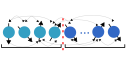

# Tools

## Entanglement Entropy
### Overview
In quantum many-body physics, the [entanglement entropy (EE)](https://en.wikipedia.org/wiki/Entropy_of_entanglement) determines the extent to which two partitions of the collective quantum system are entangled.
More simply, the EE can be thought of as quantifying the information shared between subsystem $A$ and subsystem $B$ within a many-body system.
In practice, the EE is computed as the [von Neumman entropy](https://en.wikipedia.org/wiki/Von_Neumann_entropy) of the reduced density matrix for any of the two subsystems ($A$ or $B$). 
An EE of zero implies that there is no entanglement between the subsystems.

We provide functions for two types of EE: (i) single-site entanglement entropy (SEE), and (ii) bipartite entanglement entropy (BEE):
#### (1) Single-site entanglement entropy (SEE)
The single-site entanglement entropy (SEE) quantifies the degree of entanglement between a single site (time-point) in the MPS and all other sites (time points).
Given a particular site in the MPS, $i$, the SEE is then specified by the von Neumann entropy of the reduced density matrix [RanCompressedSensing2020, LiuEntanglementFeatureExtract2021,](@cite):
$$
S_\textrm{SEE} = -\mathrm{tr}\ \rho_i \log \rho_i\,,
$$
where $\rho_i$ is the reduced density matrix (rdm) at site $i$, obtained by tracing over all sites except for the $i$-th site:
$$
\rho_i = Tr_{/i} \ket{\psi}\bra{\psi}\,,
$$
and $\ket{\psi}$ is the MPS.
Using the 1D spin-chain as an illustrative example, the SEE between a single site (dark blue) and the rest of the system (light blue) can be depicted as:


#### (2) Bipartite entanglement entropy (BEE)
The bipartite entanglement entropy (BEE) quantifies the quantum entanglement between two complementary subsystems of a matrix product state (MPS). 
For an MPS with $N$ sites, we can create a bipartition by splitting the system at any bond $l$, resulting in region $A$ (sites $1$ to $l$) and region $B$ (sites $l+1$ to $N$).
The BEE can be expressed using the singular values of the [Shmidt decomposition](https://en.wikipedia.org/wiki/Schmidt_decomposition) of either of the two subsystems:
$$
\ket{\psi} = \sum_i \alpha_i \ket{u_i}_A
\otimes \ket{v_i}_B\,,
$$
where $\alpha_i$ are the Schmidt coefficients (singular values) satisfying $\sum_i \alpha_i^2 = 1$, $\ket{u_i}_A$ and $\ket{v_i}_B$ are orthonormal states in subsystem $A$ and $B$, respectively.
The BEE is then given by the von Neumann entropy:
$$
S_\textrm{BEE} = -\sum_i \alpha_i^2 \log \alpha_i^2\,.
$$
The BEE can be represented schematically using the 1D spin chain analogy where the red dotted line denotes the bipartition, the light blue particles represent subsystem $A$ and the dark blue represent subsystem $B$:




### Bipartite Entanglement Entropy (BEE)
Given a trained MPS (for either classification or imputation), we can compute the bipartite entanglement entropy (BEE) using
the [`bipartite_spectrum`](@ref) function:
```Julia
# train the MPS as usual
mps, _, _ = fitMPS(...);
bees = bipartite_spectrum(mps);
``` 
A vector is returned where each entry contains the BEE spectrum for the class-specific MPS. 
For example, in the case of a two class problem, we obtain the individual BEE spectrums for the class 0 MPS and the class 1 MPS. 
For an unsupervised problem with only a single class, there is only a single BEE spectrum. 
#### Example
To illustrate how we might use the BEE in a typical analysis, consider an example involving real world time series from the [ItalyPowerDemand](https://www.timeseriesclassification.com/description.php?Dataset=ItalyPowerDemand) (IPD) UCR dataset. 
There are two classes corresponding to the power demand during: (i) the winter months; (ii) the summer months. 
For this example, we will train an MPS to classify between summer and winter time-series data:
```Julia
# load in the training data
using JLD2
ipd_load = jldopen("ipd_original.jld2", "r");
    X_train = read(ipd_load, "X_train")
    y_train = read(ipd_load, "y_train")
    X_test = read(ipd_load, "X_test")
    y_test = read(ipd_load, "y_test")
close(ipd_load)
opts = MPSOptions(d=10, chi_max=40, nsweeps=10; init_rng=4567)
mps, _, _ = fitMPS(X_train, y_train, X_test, y_test, opts)
```
Let's take a look at the training dataset for this problem:


Using the trained MPS, we can then inspect the BEE for the class 0 (winter) and class 1 (summer) MPS individually:
```Julia
bees = bipartite_spectrum(mps);
bee0, bee1 = bees
b1 = bar(bee0, title="Winter", label="", c=palette(:tab10)[1], xlabel="site", ylabel="entanglement entropy");
b2 = bar(bee1, title="Summer", label="", c=palette(:tab10)[2], xlabel="site", ylabel="entanglement entropy");
p = plot(b1, b2)
```


### Single-Site Entanglement Entropy (SEE)
Given a trained MPS, we can also compute the single-site entanglement entropy (SEE) using the [`single_site_spectrum`](@ref) function:
```Julia
# train MPS as usual
mps, _, _ = fitMPS(...);
sees = MPSTime.single_site_spectrum(mps);
```
As with the BEE, a vector is returned where each entry contains the SEE spectrum for the class-specific MPS. 
#### Example
Continuing our example from the BEE with the ItalyPowerDemand (IPD) dataset, we will now compute the single-site entanglement entropy (SEE) spectrum:
```Julia
sees = single_site_spectrum(mps);
see0, see1 = sees
b1 = bar(see0, title="Winter", label="", c=palette(:tab10)[1], xlabel="site", ylabel="SEE");
b2 = bar(see1, title="Summer", label="", c=palette(:tab10)[2], xlabel="site", ylabel="SEE");
p = plot(b1, b2)
```


## Docstrings
```@docs
MPSTime.single_site_spectrum
MPSTime.bipartite_spectrum
```

## Internal Methods
```@docs
MPSTime.von_neumann_entropy
MPSTime.one_site_rdm
```
